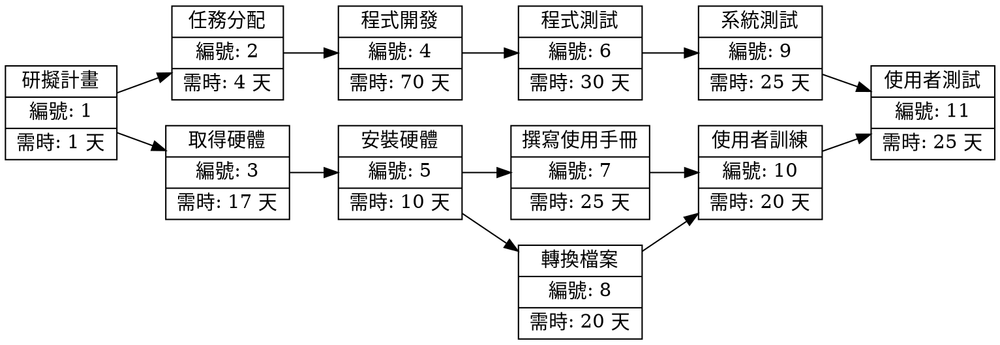

```graphviz
digraph {
	node[shape=record];
	rankdir="LR";
    task1 [label="研擬計畫 | 編號: 1 | 需時: 1 天"];
    task2 [label="任務分配 | 編號: 2 | 需時: 4 天"];
    task3 [label="取得硬體 | 編號: 3 | 需時: 17 天"]; 
    task4 [label="程式開發 | 編號: 4 | 需時: 70 天"];
    task5 [label="安裝硬體 | 編號: 5 | 需時: 10 天"];
    task6 [label="程式測試 | 編號: 6 | 需時: 30 天"];
    task7 [label="撰寫使用手冊 | 編號: 7 | 需時: 25 天"];
    task8 [label="轉換檔案 | 編號: 8 | 需時: 20 天"];
    task9 [label="系統測試 | 編號: 9 | 需時: 25 天"];
    task10 [label="使用者訓練 | 編號: 10 | 需時: 20 天"];
    task11 [label="使用者測試 | 編號: 11 | 需時: 25 天"];
   task1 -> task2
   task1 -> task3
   task2 -> task4
    task3 -> task5
    task4 -> task6
    task5 -> task7
    task5 -> task8
    task6 -> task9
    task7 -> task10
    task8 -> task10
    task9 -> task11
    task10 -> task11
}
```
